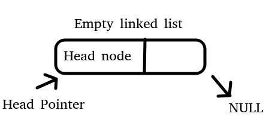
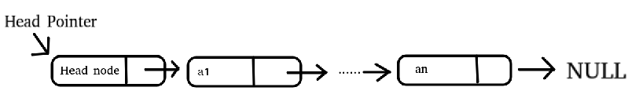

# Datastructure

## SeqList

### concept

The sequential storage structure is the storage structure in which the data with one-to-one logical relationship is continuously stored on a whole physical space in order(Sequence table)

### Source

[Click Here](https://github.com/28251536/algorithms/blob/master/DataStructure/source/SeqList.c)

## LinkList

### concept

Linked list is a chain storage method of linear list. Logically, the storage locations of adjacent data in the computer are not necessarily adjacent. Each element can be attached with a pointer field to point to the storage location of the next element.

Each node includes data field and pointer field. The pointer field stores the address of the next node, so the type pointed to by the pointer is also the node type.
In the sequence table, if you want to find the $ith$ element, you can immediately find it through $L.elem [i-1]$, which is called the **random access** method. In the single linked list, it is not so easy. You must start from scratch, one by one, and count to the $ith$ element, which is called the **sequential access** method.

### Header pointer and header node

**"Head pointer" is usually used to identify a linked list, such as single linked list L. when the head pointer is null, it indicates an empty linked list**

**Attach a node before the first node of the single linked list, which is called the head node. The data field of the header node can not set any information, or record table length and other related information**

**[note] whether there is a header node or not, the header pointer always points to the first node of the linked list. If there is a header node, the header pointer points to the header node**

### Empty  linked list

### Single linked list

### Advantages of introducing head nodes

A linked list can have no head node, but it must have a head pointer, because it is necessary to use the head pointer to identify a linked list. Set the header pointer of the linked list to pHead. In addition to the header node, you also need a pointer pNode to the general elements of the linked list (because pHead can only point to the header and cannot point to other elements, you need to set another pointer).

* Advantage 1: the insertion and deletion of the first position is particularly convenient
* Advantage 2: unify the processing of empty and non empty tables

### Source

[Have head node  Click Here](https://github.com/28251536/algorithms/blob/master/DataStructure/source/LinkListHaveHead.c)

[Not Have head node  Click Here](https://github.com/28251536/algorithms/blob/master/DataStructure/source/LinkListNoneHead.c)

## Stack And Queue

Stack is an important linear structure and a specific form of linear list (sequential list, linked list), that is, it can be realized through sequential list or linked list.
Sequential list or linked list can exist and process data independently as before. At the same time, they can also be the implementation basis of some special data structures (stack and queue).

### Stack

#### Concept

Stack is a last in first out (LIFO) linear table, which requires data insertion and deletion only at the end of the table. In other words, the so-called stack is actually a linear table, but its operation has some special requirements and restrictions.

**Linear list has two storage forms, sequential list storage and linked list storage**

#### Source

[Stack By Chain  Click Here](https://github.com/28251536/algorithms/blob/master/DataStructure/source/StackByChain.c)

[Stack By Sequential Click Here](https://github.com/28251536/algorithms/blob/master/DataStructure/source/StackBySequential.c)

### Queue

#### Concept

Queue is also an important linear structure. Like the stack, the implementation of a queue also needs a sequential list or linked list as the basis. However, unlike the stack, the queue is a first in first out (FIFO) linear table. It requires all data to enter from one section of the queue and leave from the other end of the queue. In a queue, the end that allows data to be inserted is called the end of the queue, and the end that allows data to leave is called the front. 

#### Source

[Queue Click Here](https://github.com/28251536/algorithms/blob/master/DataStructure/source/Queue.c)

